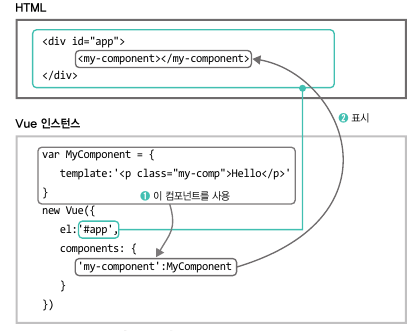

# 1. Vue.js 기초 문법

## V-디렉티브 : Vue.js의 탬플릿 문법에서 사용되는 특수 속성

|기능|서식|
|--|---|
데이터를 있는 그대로 표시 | {{ 데이터 }}
요소의 속성을 데이터로 지정 | v-bind|
입력폼과 데이터의 연결 | v-model|
이벤트 연결 | v-on|
조건에 따라 표시 | v-if|
반복해서 표시 | v-for|
데이터를 사용한 계산 | computed|
데이터의 변화 감시 | watch|
표시/비표시 애니메이션처리 | transition|
컴포넌트 조립 | component

## 1. Vue 인스턴스와 View관계


=> 준비된 데이터를 그대로 표시하고 싶을 때는 {{ }}(머스태시)를 사용한다. 데이터는 Vue 인스턴스의 data:에 넣는다.

## 2. v-bind : 준비한 데이터로 HTML 속성을 지정하고 싶은 경우사용


## 3. v-model : 유저가 입력한 값을 데이터로 사용하고 싶을 때 사용

=> 데이터를 넣을 수 있는 프로퍼티를 data:에 준비해두고, 이때 해당 데이터를 머스태시로 출력하면, 유저가 입력한 데이터가 실시간으로 출력된다.

## 4. v-on : 이벤트와 연결하기

=> v-on 디렉티브는 유저가 버튼을 클릭, 키보드 입력 등 '이벤트'가 발생할 때 Vue 메소드를 실행시키는 이벤트 핸들러

<태그명 v-on:이벤트="메소드명">으로 사용

## 5. v-if : 조건으로 값을 표시


true/false를 바꿔가며 표시할 때
```javascript
<p v-if="myVisible">체크박스는 ON</p>
<p v-else>체크박스는 OFF</p>
```


## 6. v-for : 준비한 배열 데이터를 태그에 반복하여 표시


횟수를 지정하고 반복하고 싶은경우
```javascript
<li v-for="n in 10">{{ n}}</li>

// 배열 데이터를 맨 뒤 추가할 때
this.myArray.push(추가데이터);
// 배열데이터 삭제할 때
this.myArray.splice(지정위치, 1);
```


## 7. computed : 어떤 데이터의 값이 바꿀 때 데이터를 자동으로 계산하여 보여주고 싶다면

=> 
1) computed:에 메소드명로 된 계산식을 준비해두면
2) data: 에 준비한 프로퍼티(데이터)가 바뀌어지면 data가 바뀌었을 경우,
3) computed에 등록되어 보여지는 내용이 자동으로 계산되도록 보여짐

## 8. watch : 어떤 테이터 값이 바뀔 때 자동으로 메소드를 재실행 시키고 싶다면

=> 
1) watch :에 data:의 프로퍼티(데이터)를 이용한 메소드를 준비
2) 입력한 프로퍼티 값이 변환할 때 자동 메소드 실행


### 차이점 : 
- computed : 데이터가 변하면 다시 계산
- watch : 데이터가 변하는 것을 감시하여 메소드를 실행

## 9. 컴포넌트 : 같은 종류의 처리를 하는 부분을 컴포넌트로 정리

-> '부품으로 정리한다'라는  느낌. 
template이라는 오브젝트를 사용한다. 그리고 그 오브젝트에 이름을 붙인 것을 컴포넌트라고 한다.

컴포넌트는 
1) 글로벌에서 등록하는 방법 
2) 로컬에 등록하는 방법 두가지가 있다.

컴포넌트를 글로벌에 등록하면, 그 이후에 작성되는 Vue 인스턴스에서도 사용이 가능하나, 글로벌에 등록한 모든 컴포넌트는 사용하지 않게 되어도 계속 남아있는다.

```javascript
// 컴포넌트를 글로벌에 등록
Vue.component('컴포넌트태그명', {
    template: 'HTML부분'
})

//컴포넌트 로컬에 등록
var 컴포넌트오브젝트명 = {
    template: 'HTML부분'
}
new Vue({
    el: '#app'
    components: {
        '컴포넌트태그명': 컴포넌트오브젝트명
    }
})
```

### 값 전달 : props
=> 컴포넌트에서는 HTML의 태그에서 값을 받아 전달 받는 것이 가능하다. 이를 props 옵션이라고 부른다.

```javascript
<div id="app">
    <my-component my-name="철수"></my-component>
        <my-component my-name="영희"></my-component>
    <my-component></my-component>
</div>

<script>
    var MyComponent = {
        template: '<p class="my-comp">나는 {{myName}} 입니다. </p>',
        props: {
            myName : String
        },
        create: function() {
            if (this.myName == null) {
                this.myName = "이름없음";
            }
        }
    }

    new Vue({
        el: '#app',
        components: {
            'my-component': MyComponent
        }
    })
</script>
```


